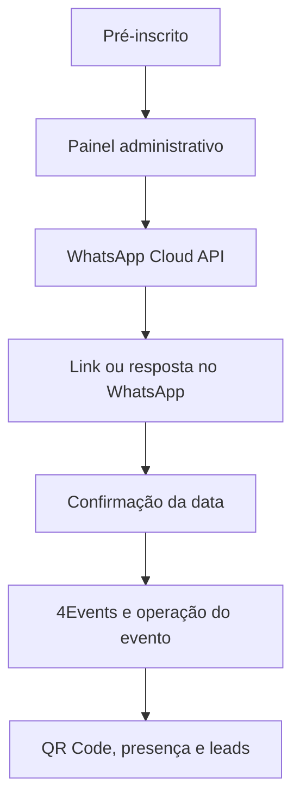
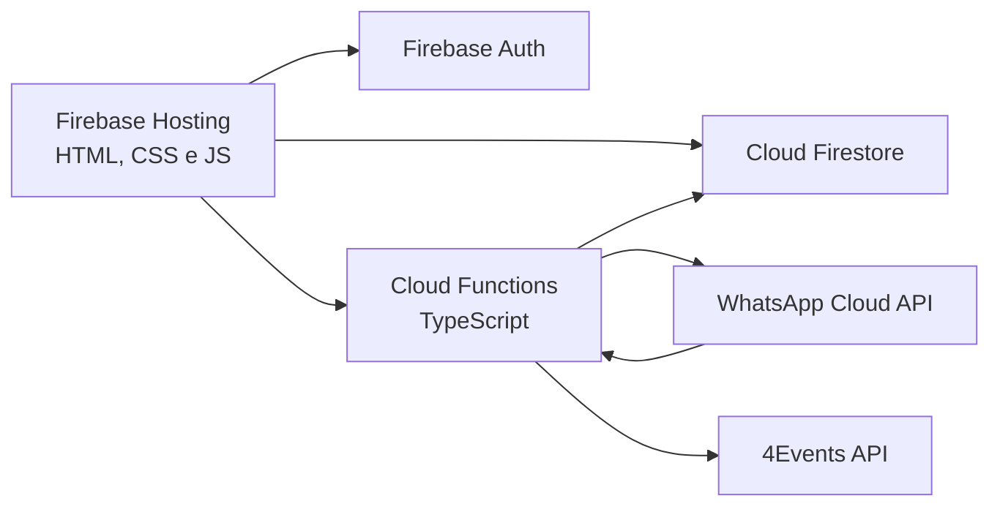

# GROB Experience 2026

Sistema operacional do **GROB Experience 2026**.

Ele organiza a jornada completa do visitante: pré-inscrição, confirmação de data pelo WhatsApp, inscrição no 4Events, acompanhamento da participação no evento e coleta presencial de leads.

> Projeto interno e específico do evento. Não é uma plataforma genérica de gestão de eventos.

## O que o sistema faz

- importa e organiza pré-inscritos;
- cria links individuais de confirmação de data;
- dispara templates aprovados pela WhatsApp Cloud API;
- acompanha aceitação, entrega, leitura e falha de mensagens;
- processa respostas e botões recebidos pelo WhatsApp;
- sincroniza e consulta participantes do 4Events;
- complementa participantes do 4Events com dados importados de planilhas Excel;
- apoia o acompanhamento de visitantes estratégicos;
- registra presença por QR Code;
- permite coleta de leads em modo offline;
- organiza vendedores, assistentes e atividades do evento.

## Fluxo principal



## Áreas da aplicação

| Área | Finalidade |
| --- | --- |
| `/app/` | Painel administrativo de pré-inscritos, confirmações e mensagens |
| `/confirmar/` | Página pública para seleção da data pelo convidado |
| `/participantes-4events/` | Consulta dos participantes sincronizados do 4Events |
| `/gestao-evento/` | Gestão de atividades e equipe de coleta |
| `/coleta-atividades/` | Leitura de QR Codes para atividades presenciais |
| `/coleta-leads/` | Captação de leads, inclusive sem conexão |
| `/webhooks/` | Monitoramento dos eventos recebidos do WhatsApp |
| `/login/` | Acesso da equipe interna |

## Arquitetura



### Tecnologias

- Frontend: HTML, CSS e JavaScript com ES Modules
- Backend: Node.js 20, TypeScript e Firebase Functions
- Dados e autenticação: Cloud Firestore e Firebase Authentication
- Integrações: WhatsApp Cloud API (Meta) e 4Events
- Infraestrutura: Firebase Hosting e Google Secret Manager

## WhatsApp

Os envios são realizados exclusivamente pelo backend. O navegador nunca recebe o token da Meta.

O sistema registra o ciclo de uma mensagem:

```text
aceito → enviado → entregue → lido
                    └──────→ falhou
```

O webhook recebe status e respostas dos participantes. Requisições `POST` da Meta são verificadas pela assinatura `X-Hub-Signature-256`, com HMAC SHA-256 e comparação segura.

## Dados no Firestore

| Coleção | Conteúdo |
| --- | --- |
| `preInscritos` | Pré-inscritos, convites, confirmação e histórico de envio |
| `linksPublicos` | Convites por token para confirmação pública |
| `inscritos` | Registros internos de inscrição |
| `participantes4Events` | Participantes sincronizados do 4Events |
| `participantes4EventsComplementos` | País, estado, cidade, endereço e dados profissionais importados por Excel |
| `visitantesEstrategicos` | Visitantes que exigem acompanhamento especial |
| `whatsappMensagens` | Estado atual das mensagens enviadas |
| `whatsappEventos` | Histórico de eventos do WhatsApp |
| `whatsappRecebidas` | Mensagens recebidas dos participantes |
| `coletaAtividades` | Atividades presenciais e responsáveis |
| `coletaAtividadesRegistros` | Leituras de QR Code por atividade |
| `coletaLeads` | Leads coletados pela equipe |
| `users` | Perfis e papéis internos |

### Complementos dos participantes 4 Events

Administradores podem importar uma planilha Excel em `/participantes-4events/` para preencher País, Estado, Cidade, Endereço, Empresa, Cargo, Nível e Setor Industrial. Cada linha deve ter pelo menos um identificador: ID participante, QRCODE, e-mail ou CPF.

Os registros ficam em `participantes4EventsComplementos`. Novas importações atualizam chaves já existentes e adicionam as demais. A correlação usa IDs de documento determinísticos e leituras diretas; portanto, não exige índice composto no Firestore.

## Papéis internos

| Papel | Acesso principal |
| --- | --- |
| Administrador | Gestão do evento, mensagens, equipe, dados e integrações |
| Assistente de coleta | Atividades presenciais sob sua responsabilidade |
| Vendedor | Coleta e consulta dos próprios leads |

As regras do Firestore protegem o acesso direto do cliente; operações privilegiadas são concentradas nas Cloud Functions.

## Desenvolvimento local

Pré-requisitos:

- Node.js 20
- Firebase CLI
- acesso ao projeto Firebase correspondente

```bash
git clone https://github.com/evertaraujo-lgtm/GrobExperience2026.git
cd GrobExperience2026/functions
npm install
npm run build
```

Para iniciar os emuladores:

```bash
npm run serve
```

## Deploy

```bash
firebase deploy --only hosting
firebase deploy --only firestore:rules
firebase deploy --only functions
```

Para publicar tudo:

```bash
firebase deploy
```

## Secrets necessários

As credenciais devem existir apenas no Firebase Secret Manager:

```text
META_WHATSAPP_ACCESS_TOKEN
META_APP_SECRET
META_WEBHOOK_VERIFY_TOKEN
FOUR_EVENTS_TOKEN
```

Nunca versione tokens, contas de serviço, planilhas de participantes, exportações ou arquivos `.env`.

## Segurança e privacidade

- Tokens de confirmação são aleatórios e a listagem pública de convites é bloqueada.
- O painel requer autenticação.
- As mensagens são enviadas pelo backend.
- O webhook valida a assinatura da Meta.
- Dados de participantes devem permanecer no Firestore e nas fontes autorizadas — não no Git.
- Arquivos de importação e exportação são locais e descartáveis.

## Estrutura resumida

```text
public/                 interfaces web
functions/src/          Cloud Functions em TypeScript
firestore.rules         regras de acesso
firestore.indexes.json  índices do Firestore
firebase.json           configuração de deploy
agent.md                runbook técnico e operacional
```

## Status

O sistema foi construído para apoiar a operação real do GROB Experience 2026, reduzindo trabalho manual em confirmações, mensagens, presença e captação de oportunidades no evento.
